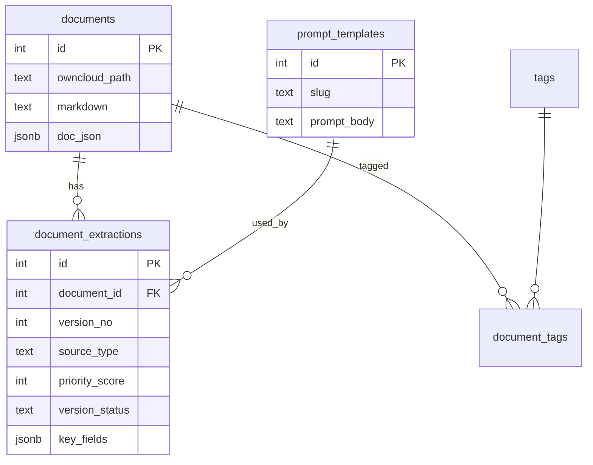

# Plan — Flow Webchat → Teable với multi-version

## Kiến trúc dữ liệu



## Luồng vận hành

### A. Pipeline tự động (máy)

1. Sync OCIS → `documents`
2. OCR → insert `document_extractions` `local_llm_ocr` (30)
3. (Tuỳ chọn) Google Vision → `google_vision` (70)
4. DeepSeek enrich → `deepseek_cleanup` (50)
5. Sync Teable `DocExtractions` + cập nhật `active_*` trên OwnCloud

### B. Luồng nhân viên (Webchat)

1. Mở văn bản trên Teable / link OCIS
2. Chọn **PromptTemplates** (VD: phạm vi hành nghề)
3. Webchat AI bóc tách → preview JSON
4. User sửa → lưu `document_extractions` `human_webchat` (95), `version_status=draft`
5. User «Xác nhận» → `human_verified` (100), `version_status=active`
6. Các version cũ cùng doc → `superseded` nếu priority thấp hơn

### C. Chọn bản «đang dùng»

```sql
SELECT DISTINCT ON (document_id) *
FROM document_extractions
WHERE version_status IN ('active', 'draft')
ORDER BY document_id, priority_score DESC, updated_at DESC;
```

## Teable relations

- `DocExtractions.document` → **manyOne** → `OwnCloud`
- Symmetric link tự tạo trên OwnCloud (xem cột link ngược)

## P1 — Implement tiếp

- [ ] `sync_extractions_to_teable.py`
- [ ] Webhook Teable → Postgres khi user PATCH `human_verified`
- [ ] Job recompute `active_priority` / `active_source` trên OwnCloud
- [ ] Google Vision ingest script → `google_vision` rows

## P2 — Quyền API Teable (tắt sau setup)

Giữ: record GET/POST/PATCH, field GET (đọc schema).  
Có thể tắt: POST table, POST field, DELETE table/field nếu schema đóng.

Chi tiết: `09_logs/teable-api-permissions-audit.json`
