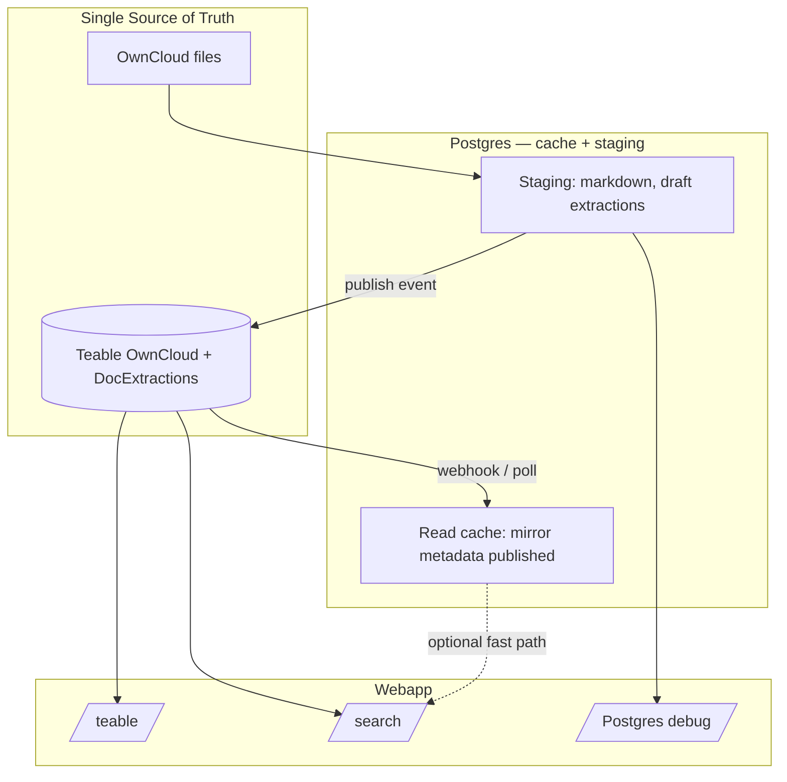

# Plan — Kiến trúc luồng Teable SoT + Postgres cache

**Ngày:** 2026-07-01

## Mục tiêu

Metadata tra cứu (PCN, filter, LLM context) **luôn có nguồn gốc Teable**. Postgres chỉ cache/staging — tối ưu tốc độ **không** được đánh đổi tính đúng SoT.

## Mô hình 3 tầng



## Phân vai chi tiết

### Teable (SoT)

| Bảng | Chứa | Ai sửa |
|------|------|--------|
| OwnCloud | path, phòng ban, status UI, link extractions | Pipeline publish + PCN (một số field) |
| DocExtractions | key_fields, ai_doc_type, tags, summary, version_status | Pipeline publish + PCN verify |

**Quy tắc hiệu lực:** Chỉ `version_status=active` (và link OwnCloud hợp lệ) được đưa vào search/LLM.

### Postgres (cache + staging)

| Dữ liệu | Loại | Ghi chú |
|---------|------|---------|
| `documents.markdown` | Staging | Không expose PCN |
| `document_extractions` draft | Staging | Trước publish |
| `document_extractions` sau publish | Cache row | Copy từ Teable; `teable_record_id` |
| `effective_document_extractions` view | **Derived** | Tính từ cache; invalidate khi Teable đổi |
| `published_to_teable_at` | Marker | Phân biệt draft vs published |

### UI webapp

| Route | Đọc gì | Ghi chú |
|-------|--------|---------|
| `/teable` | Teable API | SoT trực tiếp (đã có) |
| `/search` | **Teable** (mục tiêu) | Hôm nay: Postgres — cần đổi |
| `/` Postgres tab | Staging + debug OCR | Đổi nhãn "Pipeline cache", không "Catalog SoT" |

## Luồng sự kiện

### E1 — Pipeline publish (Postgres → Teable)

```text
1. OCR/enrich xong trên Postgres (draft → active nội bộ)
2. upsert Teable OwnCloud + DocExtractions
3. Ghi teable_record_id, published_to_teable_at trên Postgres
4. (Tuỳ chọn) refresh read-cache row từ response Teable
```

### E2 — Human edit (Teable → Postgres cache)

```text
1. PCN sửa field trên Teable
2. Webhook hoặc poll (5 phút) nhận PATCH
3. Upsert human_verified extraction trên Postgres HOẶC chỉ refresh cache mirror
4. Không chạy lại OCR
```

### E3 — User search / LLM

```text
CATALOG_READ_MODE=teable:
  teable_search.py → filter OwnCloud + join DocExtractions → llm_context_pack

CATALOG_READ_MODE=cache (sau khi cache đồng bộ):
  Postgres effective_* WHERE cache_synced_at > last_teable_change
  Fallback Teable nếu cache miss / stale
```

## Tối ưu tốc độ (không phá SoT)

| Chiến lược | Độ phức tạp | SoT đúng? |
|------------|---------------|-----------|
| A. Luôn Teable API | Thấp | Có (chậm) |
| B. Postgres materialized cache + webhook | Trung bình | Có (nhanh khi cache fresh) |
| C. Postgres như hôm nay | Thấp | **Không** |

**Đề xuất:** B — Teable SoT + `teable_mirror` hoặc tái dùng bảng hiện tại với cột `source_of_truth=teable`, `cache_synced_at`, webhook invalidate.

## Phase triển khai

### Phase 0 — Thống nhất ngôn ngữ (xong doc)

- [x] Ghi memory/plan/report workflow cache vs SoT
- [ ] Đổi nhãn UI Postgres tab → "Pipeline / OCR cache"

### Phase 1 — Search đọc Teable

- [ ] `teable_search.py`: staff + degrees từ Teable fields
- [ ] `llm_context_pack`: provider `CATALOG_SOT=teable`
- [ ] `/api/search/context` mặc định Teable

### Phase 2 — Publish contract

- [ ] Migration: `published_to_teable_at`, `cache_synced_at` trên extractions/documents
- [ ] Publish chỉ qua một hàm `publish_to_teable(document_id)`

### Phase 3 — Teable → cache

- [ ] Webhook endpoint hoặc `poll_teable_changes.py` cron
- [ ] Conflict: Teable wins

### Phase 4 — Read cache fast path

- [ ] `CATALOG_READ_MODE=cache` sau webhook ổn định
- [ ] Metric: cache hit rate, stale age

## Câu hỏi mở (cần PCN quyết)

1. Webhook Teable có sẵn trên `noibo.hungthinh.hospital` không, hay poll 5 phút đủ?
2. PCN có sửa trực tiếp trên Teable hàng ngày không — tần suất quyết định cache TTL.
3. Tab Postgres `/` giữ cho dev/pipeline hay ẩn với user cuối?
