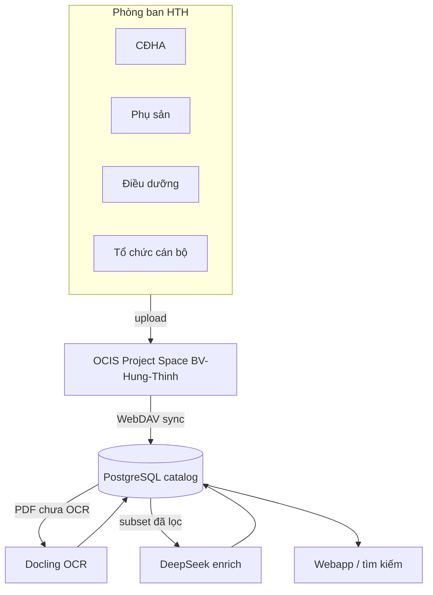

# Report — Tư vấn Cloud + AI cho Bệnh viện Hưng Thịnh

## Tóm tắt

Stack hiện tại (OCIS + PostgreSQL + Docling OCR + DeepSeek enrich) **phù hợp** mô hình bệnh viện: phòng ban đưa tài liệu lên Cloud, catalog tập trung, AI hỗ trợ tìm/phân loại, collaboration qua Project Spaces.

## Vì sao phù hợp HTH

| Nhu cầu BV | Giải pháp đang có |
|------------|-------------------|
| Phòng ban tự upload | OCIS Project Space + quyền Manager/Editor |
| Không mất file khi nhân sự đổi | Project Space team-owned (không gắn 1 user) |
| Tìm nhanh quyết định, HĐ, biểu mẫu | Postgres FTS + tag/category |
| AI rẻ, có kiểm soát | Lọc subset → `ai_enrich_documents.py` (DeepSeek) |
| Self-hosted, không phụ thuộc Google/M365 | OCIS Docker local / on-prem sau này |

## Bằng chứng từ dữ liệu thử

Batch `/Yen` (477 file) đã map sẵn phòng ban: CĐHA, Phụ sản, Điều dưỡng, hồ sơ cán bộ — đây là prototype cấu trúc **BV-Hung-Thinh**.

## Kiến trúc đề xuất

## Khuyến nghị ưu tiên (90 ngày)

1. **Tuần 1–2:** Tạo Project Space `BV-Hung-Thinh`, chuẩn hóa tên thư mục phòng.
2. **Tuần 3–4:** Pilot phòng Tổ chức cán bộ (đã có data `/Yen`) — sync + OCR PDF.
3. **Tháng 2:** Mở rộng CĐHA, Phụ sản; chính sách quyền + loại tài liệu được AI xử lý.
4. **Tháng 3:** Verified metadata từ phòng ban; webapp đọc Postgres cho lãnh đạo tra cứu.

## Rủi ro cần quản lý

- **Dữ liệu nhạy cảm:** CMND, hồ sơ BN — cần phân vùng và chính sách AI.
- **Chất lượng OCR:** scan mờ → EasyOCR đã chọn làm baseline; spot-check theo phòng.
- **Thói quen phòng ban:** cần SOP upload + đặt tên file thống nhất.

## Kết luận

Hướng **Cloud phòng ban → catalog → AI có chọn lọc** là đúng cho Hưng Thịnh. Bước tiếp: chuyển từ Personal `/Yen` sang Project Space `BV-Hung-Thinh` và pilot một phòng.
