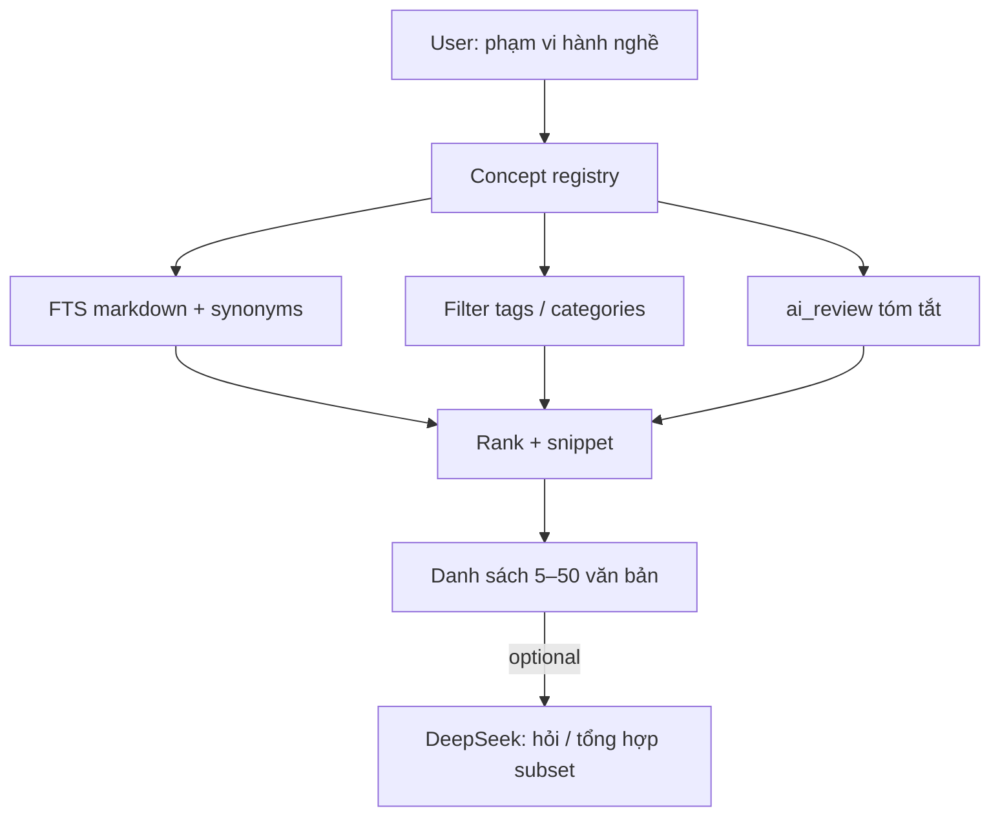

# Report — Tư vấn: tìm «phạm vi hành nghề» và thu hẹp không gian cho AI

## Câu hỏi

Nhân viên BV gõ **«phạm vi hành nghề»** và muốn **tất cả văn bản liên quan** hiện lên. Làm sao xử lý, trong bối cảnh cần **thu nhỏ dữ liệu** trước khi đưa vào AI suy luận?

## Trả lời ngắn

**Tách hai việc:**

1. **Liệt kê văn bản liên quan** → search đa tín hiệu trên Postgres (FTS + tag + category + concept map). **Không dùng LLM** mỗi lần gõ.
2. **Suy luận / tổng hợp** → chỉ khi user chọn subset (ví dụ 15 doc) mới gọi DeepSeek.

Đúng với kinh nghiệm API email cũ: **lọc trước → context vừa phải → AI sau**.

---

## Vì sao không chỉ gõ từ khóa vào AI?

| Cách | Vấn đề |
|------|--------|
| Đưa 447 markdown vào 1 prompt | Vượt context, tốn token, chậm, dễ bỏ sót |
| Chỉ search tên file | User không nhớ tên file — use case «phạm vi hành nghề» fail |
| Chỉ exact match OCR | Bỏ sót văn bản viết «chứng chỉ hành nghề», «GP», «đăng ký hành nghề» |

Cần **index ngữ nghĩa lúc ingest** + **mở rộng query lúc search**.

---

## Luồng xử lý đề xuất

### Bước 1 — User gõ khái niệm

Query **«phạm vi hành nghề»** được map sang concept `pham-vi-hanh-nghe` và mở rộng:

- Đồng nghĩa tìm kiếm: *hành nghề*, *chứng chỉ hành nghề*, *giấy phép hành nghề*, *đăng ký hành nghề*…
- Tag mong đợi: `pham-vi-hanh-nghe`, `hanh-nghe`…
- Category gợi ý: *Quy định*, *Pháp lý*

*(Danh sách do phòng ban duyệt trong `concepts_vi.json` — không cần AI mỗi lần.)*

### Bước 2 — Hệ thống gom doc (0 token)

Với mỗi tài liệu trong catalog, cộng điểm nếu:

- OCR chứa bất kỳ synonym nào → **điểm cao nhất**
- Đã gắn tag liên quan (từ AI enrich batch) → **bắt doc không dùng đúng cụm từ**
- `ai_category` / `ai_review` khớp → **bổ sung recall**

Trả về danh sách **có thứ tự** + **đoạn trích** (2–3 dòng quanh chỗ khớp) để nhân viên tự xác nhận «đúng văn bản mình cần».

### Bước 3 — AI chỉ khi cần suy luận

Ví dụ: *«Trong các văn bản này, phạm vi hành nghề bác sĩ nội trú khác gì so với quy định cũ?»*

→ API gửi **chỉ** top 10–20 snippet đã chọn → DeepSeek trả lời.

---

## Vai trò AI enrich (batch, không phải lúc search)

`ai_enrich_documents.py` đọc OCR **một lần** và gán:

- Tag `pham-vi-hanh-nghe` nếu nội dung **liên quan** dù không có đúng cụm «phạm vi hành nghề»
- `ai_review`: *«Văn bản quy định điều kiện đăng ký và phạm vi hành nghề…»*

Đây là mảnh ghép quan trọng cho use case nhân viên: **search theo ý nghĩa**, không chỉ literal string.

---

## So với hiện trạng repo

| Thành phần | Trạng thái |
|------------|------------|
| OCR ~447 PDF | ✅ |
| AI enrich tag/category | ⏳ chưa chạy full |
| Search nội dung OCR | ❌ webapp chỉ search path/tên file |
| Concept registry | ❌ chưa có |
| Multi-signal search API | ❌ chưa có |

**Ưu tiên ngay:** enrich batch → concept file (10 concept) → search API FTS + tag.

---

## Ví dụ kết quả mong đợi

User gõ: `phạm vi hành nghề`

| # | File | Lý do hiện | Snippet |
|---|------|------------|---------|
| 1 | QĐ-123_2024.pdf | FTS «phạm vi hành nghề» | «…quy định **phạm vi hành nghề** của nhân viên y tế…» |
| 2 | TT-BYT-45.pdf | Tag `hanh-nghe` | «…điều kiện **cấp chứng chỉ hành nghề**…» |
| 3 | Bien-ban-PCT.pdf | `ai_review` khớp | Tóm tắt AI nhắc đăng ký hành nghề |

User lọc thêm: phòng *Phòng khám* → còn 8 doc → bấm «Hỏi AI».

---

## Rủi ro & giảm thiểu

| Rủi ro | Giảm pháp |
|--------|-----------|
| Quá nhiều kết quả | Filter phòng ban / năm; tăng ngưỡng score |
| Bỏ sót | Mở rộng synonym trong concept; enrich tag |
| False positive | Hiển thị score + snippet; verified_metadata |
| OCR lỗi chữ «hành nghề» | FTS simple + tag AI; sau này unaccent |

---

## Verdict

Use case **«gõ phạm vi hành nghề → load văn bản liên quan»** xử lý bằng **concept search đa tín hiệu trên catalog đã enrich**, không phải **một lần gọi AI quét cả kho**.

AI có hai chỗ: **(A)** gán tag/tóm tắt lúc index; **(B)** trả lời sâu trên subset user đã thấy. Đó chính là cách **thu hẹp không gian** đúng nghĩa cho nhân viên bệnh viện.
