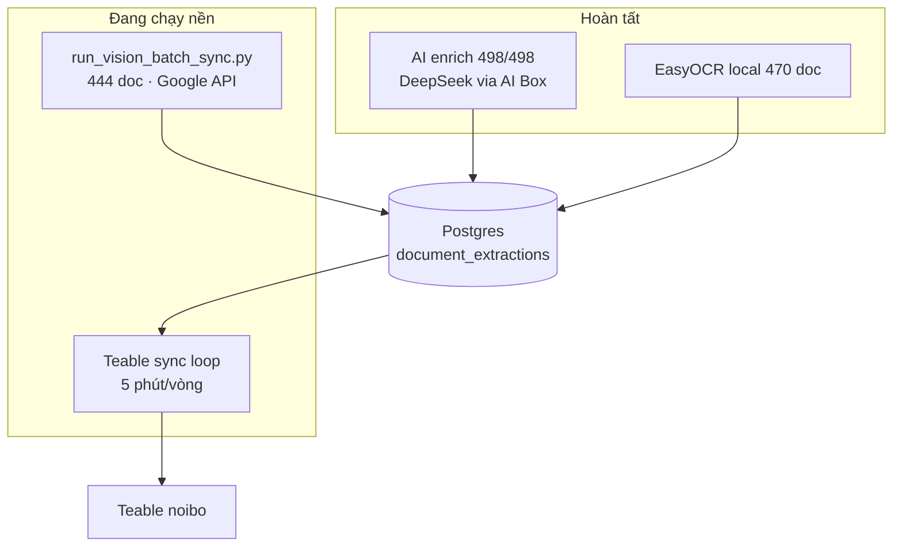

# Báo cáo triển khai Google Vision song song

**Thời điểm:** 2026-06-30 08:10  
**Branch:** `develop`

---

## Tóm tắt

Đã khởi động **Google Vision batch** (`gemini-2.5-flash`) chạy **nền**, song song với **Teable sync loop** đang hoạt động. Lane **AI enrich** đã hoàn tất trước đó (498/498 success).

| Hạng mục | Giá trị |
|----------|---------|
| Doc trong queue | **444** |
| Đã có vision (pilot) | 3 |
| Model | `gemini-2.5-flash` |
| Sleep | 12s/doc |
| ETA ước tính | ~2.5–3.5 giờ |
| API probe | ✅ OK |

---

## Kiến trúc song song



**Không conflict** vì mỗi lane ghi `source_type` riêng trong `document_extractions`; effective metadata recompute sau batch.

---

## Kết quả pilot đầu batch

```
[OK] doc_id=506 extraction_id=1338 text_len=1268
[OK] doc_id=507 extraction_id=1339 text_len=1097
```

Batch bắt đầu: `2026-06-30T01:11:05Z`

---

## Theo dõi tiến độ

```bash
# Đếm vision đã xong
docker exec ocr-pipeline-postgres psql -U ocr -d ocr_catalog -t -c \
  "SELECT count(DISTINCT document_id) FROM document_extractions WHERE source_type='google_vision';"

# Tail log
tail -f workspace/ocr_pipeline/09_logs/20260630_0810-vision-batch.log
```

---

## Việc sau batch

1. `uv run python scripts/recompute_effective_metadata.py --sync-teable`
2. Xác nhận Teable OwnCloud + DocExtractions phản ánh `active_source=google_vision`
3. Xử lý doc fail (nếu có) — retry `--doc-id`
