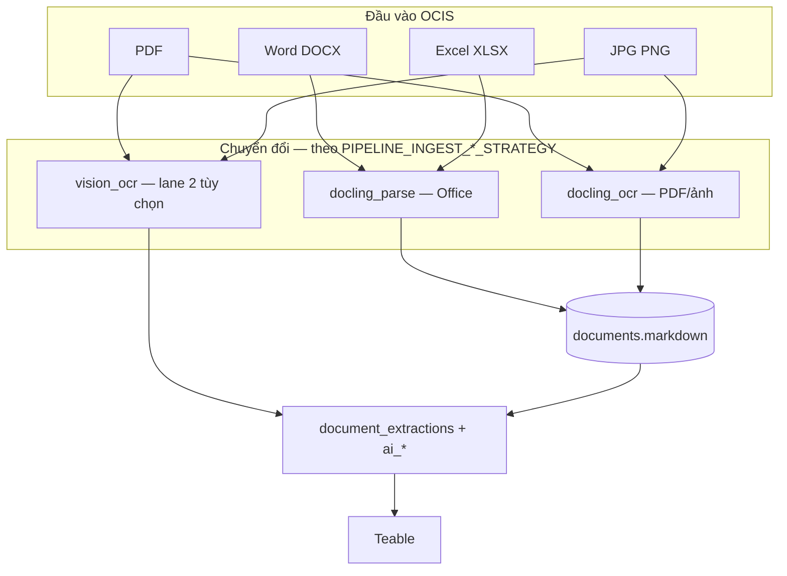

# Báo cáo: Word, Excel, Ảnh — luồng xử lý & Markdown

**Thời điểm:** 2026-06-30 10:05

## Câu trả lời ngắn

**Có — mọi tài liệu đều phải ra Markdown** (lưu `documents.markdown`), rồi mới đi các lane enrich/vision. Khác nhau ở **cách tạo markdown**, không phải ở đích cuối.

## Sơ đồ hội tụ



## Chi tiết từng loại

### Word / Excel / PowerPoint

- Docling **đọc trực tiếp** file Office (Open XML) → `DoclingDocument` → **export Markdown**.
- **Không** nên OCR bitmap trừ khi file là scan lưu trong Word (hiếm).
- VAR: `PIPELINE_INGEST_DOCX_STRATEGY=docling_parse`, tương tự xlsx/pptx.

### Ảnh JPG / PNG

- **Lane 1:** Docling image pipeline + EasyOCR → markdown (`local_llm_ocr`).
- **Lane 2:** Vision API đọc bytes ảnh trực tiếp (`vision_tasks` đã hỗ trợ).
- Cả hai đều enrich AI riêng trên text của lane đó.

### PDF

- Giữ như hiện tại: Docling OCR full + vision trang 1 (pilot).

### Audio (M4A — 1 file trong catalog)

- Cần Docling `asr` extra → transcript → markdown. Phase sau.

## Catalog HTH chưa xử lý

| Đuôi | Chưa OCR (`cataloged`) |
|------|------------------------|
| .jpg | 21 |
| .docx | 6 |
| .m4a | 1 |

Nguyên nhân: `ocr_catalog_postgres.py` mặc định **chỉ PDF**.

## Cấu hình VAR mới

```env
PIPELINE_INGEST_EXTENSIONS=.pdf,.docx,.xlsx,.pptx,.png,.jpg,.jpeg
PIPELINE_INGEST_DOCX_STRATEGY=docling_parse
PIPELINE_INGEST_XLSX_STRATEGY=docling_parse
PIPELINE_INGEST_IMAGE_STRATEGY=docling_ocr
```

Code: `workspace/ocr_pipeline/ingest_formats.py`

## Bước tiếp theo

Mở rộng `ocr_catalog_postgres.py` dùng `ingest_formats` thay `--only-pdf`, chạy pilot 28 file còn lại.
