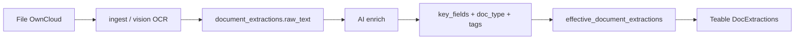

# Hướng dẫn — Đưa metadata giấy tờ vào CSDL để lọc được

**Ngày:** 2026-06-30

## Ý chính

Đúng là **mỗi loại giấy cần metadata có cấu trúc** để lọc (tên bác sĩ, số chứng chỉ, ngày hết hạn…). Nhưng bạn **không cần khai báo thủ công từng file**: hệ thống đã có luồng **OCR → AI enrich → Postgres → Teable**.

---

## Luồng dữ liệu (tự động)



| Bước | Công cụ | Bảng/cột |
|------|---------|----------|
| 1. Quét file | `scripts/ocr_catalog_postgres.py` | `documents` |
| 2. OCR → text | Docling / Google Vision / ASR | `document_extractions.raw_text` |
| 3. Trích metadata | `ai_enrich.enrich_extraction_from_ocr_text` | `category`, `doc_type`, `tags`, `key_fields` |
| 4. Metadata “hiệu lực” | View waterfall | `effective_document_extractions` |
| 5. UI hành chính | `sync_extractions_to_teable.py` | Teable `key_fields_json` |

**Single Source of Truth:** Postgres `document_extractions`. Teable là bản mirror để filter/view.

---

## Metadata lưu ở đâu?

```sql
-- Cấu trúc bảng (rút gọn)
document_extractions (
  document_id,
  source_type,      -- local_llm_ocr | deepseek_cleanup | google_vision | human_verified
  category,         -- Nhân sự, Hợp đồng lao động, ...
  doc_type,         -- chung-chi-hanh-nghe, can-cuoc-cong-dan, ...
  tags,             -- JSON array, slug chuẩn từ taxonomy_vi.json
  key_fields,       -- JSONB: ten, so, ngay, don_vi, (sắp thêm ngay_het_han, pham_vi)
  extracted_summary -- tóm tắt tiếng Việt
)
```

Ví dụ query sau enrich:

```sql
SELECT d.id, e.doc_type, e.key_fields
FROM documents d
JOIN effective_document_extractions e ON e.document_id = d.id
WHERE e.doc_type = 'chung-chi-hanh-nghe'
  AND e.key_fields->>'ten' ILIKE '%hiển%';
```

---

## Ai “cung cấp” metadata?

| Nguồn | Khi nào | Độ tin cậy |
|-------|---------|------------|
| **AI enrich** (mặc định) | Sau mỗi OCR, tự chạy trong pipeline / Teable loop | Cao nếu OCR tốt; cần review chứng chỉ hạn |
| **taxonomy_vi.json** | Chuẩn hóa `doc_type` / `tags` trước khi ghi DB | Canonical slug cho filter |
| **concepts_vi.json** | Map từ khóa tìm kiếm → tags/categories | Search API |
| **Human verified** | PCN sửa trên Teable / webchat | Ưu tiên cao nhất (waterfall) |

Prompt enrich hiện tại (`workspace/ocr_pipeline/ai_enrich.py`):

```json
"key_fields": {"ten": "...", "so": "...", "ngay": "...", "don_vi": "..."}
```

→ Đủ cho tìm tên/số cơ bản; **chưa đủ** cho “còn hạn” vì thiếu `ngay_het_han` thống nhất.

---

## Phương án mở rộng theo loại giấy (đề xuất)

### Bước A — Khai báo schema ngoài DB (không cần migration mỗi field)

File config `metadata_schemas_vi.json` (plan): mỗi `doc_type` liệt kê field bắt buộc.

| doc_type | key_fields bắt buộc |
|----------|---------------------|
| `chung-chi-hanh-nghe` | ten, so, ngay, **ngay_het_han**, **pham_vi**, don_vi |
| `can-cuoc-cong-dan` | ten, so, ngay_sinh, que_quan |
| `bang-tot-nghiep` | ten, so, ngay, don_vi, chuyen_nganh |

Vẫn lưu trong **một cột JSONB** — không cần thêm 20 cột SQL.

### Bước B — Enrich biết schema

- Inject danh sách field vào prompt theo `doc_type` (hoặc enrich 2 bước: classify → extract).
- Bảng `prompt_templates` trong Postgres cho phép sửa prompt theo loại giấy qua Teable.

### Bước C — Lọc nhanh (khi cần)

SQL view hoặc generated column cho field hay filter:

```sql
(e.key_fields->>'ngay_het_han')::date >= CURRENT_DATE  -- chứng chỉ còn hạn
```

### Bước D — Backfill file cũ

```bash
uv run python scripts/backfill_vision_ai_metadata.py --force --sleep-seconds 30
uv run python scripts/sync_extractions_to_teable.py
```

---

## So sánh phương án lưu trữ

| Phương án | Ưu | Nhược |
|-----------|-----|-------|
| **JSONB `key_fields` (hiện tại)** | Linh hoạt mọi loại giấy; không migration mỗi field | Filter date cần cast; validate sau enrich |
| **Cột riêng từng field** | Index/filter SQL đơn giản | Migration liên tục; 20+ loại giấy = 20+ cột sparse |
| **Bảng `staff` + FK** | Query nhân sự chuẩn hóa | Cần dedup tên OCR; effort lớn hơn MVP |
| **Chỉ path OwnCloud** | Không cần enrich | Không có ngày hết hạn, số chứng chỉ |

**Khuyến nghị:** giữ JSONB + schema config + view cho field “nóng”; bảng nhân sự chỉ khi có nhu cầu dedup/HRIS.

---

## Việc cần làm để lọc “chứng chỉ còn hạn”

1. Thêm `ngay_het_han`, `pham_vi` vào schema enrich cho `chung-chi-*`.
2. Backfill extractions hiện có.
3. Teable view: `doc_type` + parse `key_fields_json`.
4. (Tuỳ chọn) SQL view `document_certificate_status` cho báo cáo compliance.

Chi tiết triển khai: [plans/20260630_1910-per-doctype-metadata-schema-plan.md](../plans/20260630_1910-per-doctype-metadata-schema-plan.md).

---

## Tóm tắt một câu

Metadata **không nhập tay file-by-file** — pipeline OCR + AI enrich **điền vào `document_extractions.key_fields`**; bạn chỉ cần **định nghĩa schema theo `doc_type` trong config** và **backfill** để mọi giấy tờ cũ có đủ field lọc được.
