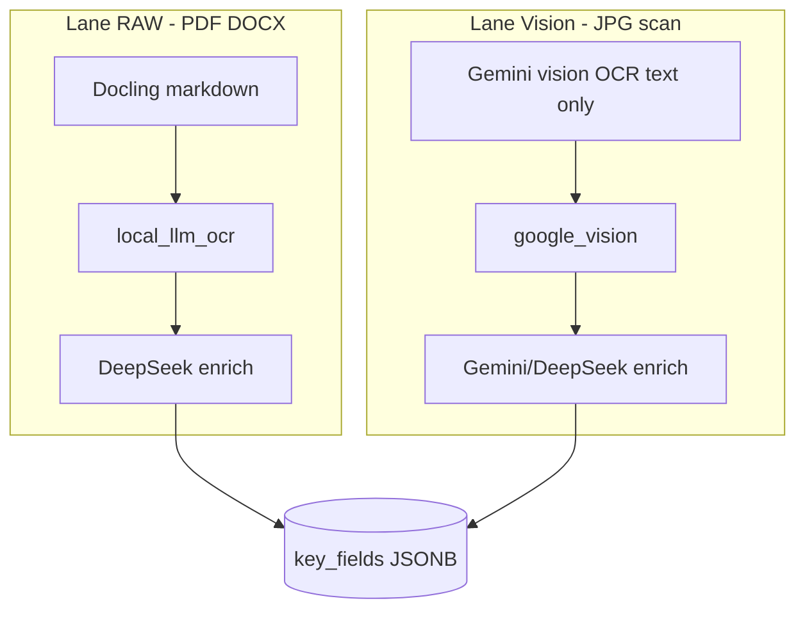

# Báo cáo — Có cần thêm một đợt AI để lấy metadata không?

**Ngày:** 2026-06-30

## Câu trả lời

**Có — và hệ thống đã thiết kế sẵn lượt đó.** Bạn không cần “phát minh” thêm một pipeline mới; cần **mở rộng chất lượng và schema** của lượt enrich hiện có, và (tuỳ chọn) **gộp OCR + metadata** trên lane Gemini ảnh.

---

## Hai việc khác nhau

| Việc | Mục đích | Ai làm hôm nay |
|------|----------|----------------|
| **Lượt 1 — OCR** | Đọc chữ từ ảnh/PDF/DOCX | Docling, EasyOCR, Gemini vision |
| **Lượt 2 — Enrich** | Hiểu *đây là giấy gì*, trích field lọc được | DeepSeek / Gemini text (`ai_enrich.py`) |

Giấy khai sinh, CCCD, bằng cấp… **bắt buộc có lượt 2** (hoặc tương đương) vì:

- OCR chỉ cho chuỗi text, không có `doc_type`, `ngay_het_han`, `chuyen_nganh`.
- Cùng một layout có thể là bản sao công chứng hay bản gốc — cần ngữ cảnh.
- Tên file/path gợi ý nhưng không đủ cho compliance.

---

## Trong code hiện tại

- Vision prompt (`pipeline_config.py`): *"OCR toàn bộ văn bản… plain text"* — **không** trả metadata.
- Ngay sau đó: `enrich_vision_extraction()` → `enrich_extraction_from_ocr_text()` — **đây chính là “đợt AI thứ hai”.**

Vậy câu “chắc chắn cần thêm một đợt AI” → **đúng về mặt nghiệp vụ**, nhưng **đợt đó đã nối sẵn** sau OCR; việc còn lại là làm enrich **đủ thông minh** cho từng loại giấy.

---

## Gemini “có thể lấy luôn” không?

**Có thể về mặt kỹ thuật**, nhưng **chưa bật** trong repo:

| Cách | Call API | Ghi chú |
|------|----------|---------|
| Hiện tại | Vision OCR + Enrich riêng | 2 call/ảnh; enrich có thể cùng `gemini-2.5-flash` |
| Tối ưu (đề xuất) | 1 prompt JSON: `raw_text` + `key_fields` + `doc_type` | Giảm quota 429; cần parse JSON an toàn |
| RAW lane | Luôn ≥2 bước | Docling không thay enrich |

Khi `PIPELINE_VISION_ENRICH_PROVIDER=google`, lượt 2 **đã dùng Gemini** — chỉ là **tách request**, không phải “một lần duy nhất”.

---

## Còn thiếu gì cho giấy khai sinh, CCCD, bằng cấp?

1. **Schema `key_fields` theo `doc_type`** — không dùng chung 4 field `ten/so/ngay/don_vi`.
2. **Enrich có ngữ cảnh loại giấy** — prompt riêng hoặc bước classify → extract.
3. **Backfill** toàn bộ doc đã OCR nhưng enrich schema cũ.
4. (Tuỳ chọn) **Single-pass Gemini** cho ảnh CCCD/giấy khai sinh.

Ví dụ field mong muốn:

| doc_type | key_fields |
|----------|------------|
| `giay-khai-sinh` | ho_ten, ngay_sinh, noi_sinh, ho_ten_cha, ho_ten_me, so_dang_ky |
| `can-cuoc-cong-dan` | ten, so_cccd, ngay_sinh, que_quan, ngay_cap, noi_cap |
| `bang-tot-nghiep` | ten, so, ngay_cap_bang, truong, chuyen_nganh, xep_loai |
| `chung-chi-hanh-nghe` | ten, so, ngay_cap, **ngay_het_han**, pham_vi, don_vi |

---

## Khuyến nghị thực hiện

**Giai đoạn 1 (ngay):** Mở rộng lượt enrich hiện có — `metadata_schemas_vi.json` + backfill. Không đổi OCR.

**Giai đoạn 2:** Pilot single-pass Gemini trên ảnh nhân sự (CCCD, chứng chỉ) nếu quota cho phép.

**Giai đoạn 3:** Human verify trên Teable cho field quan trọng (`human_verified` ưu tiên waterfall).

---

## Tóm tắt một câu

Bạn **đúng**: cần AI đọc ngữ cảnh để lấy metadata còn lại; pipeline **đã có lượt enrich thứ hai** — cần **làm sâu hơn theo từng loại giấy**; Gemini **có thể gộp OCR+metadata một lần** cho ảnh nhưng **hiện đang tách hai bước**.

Chi tiết triển khai: [plans/20260630_1914-two-pass-ai-metadata-extraction-plan.md](../plans/20260630_1914-two-pass-ai-metadata-extraction-plan.md)
